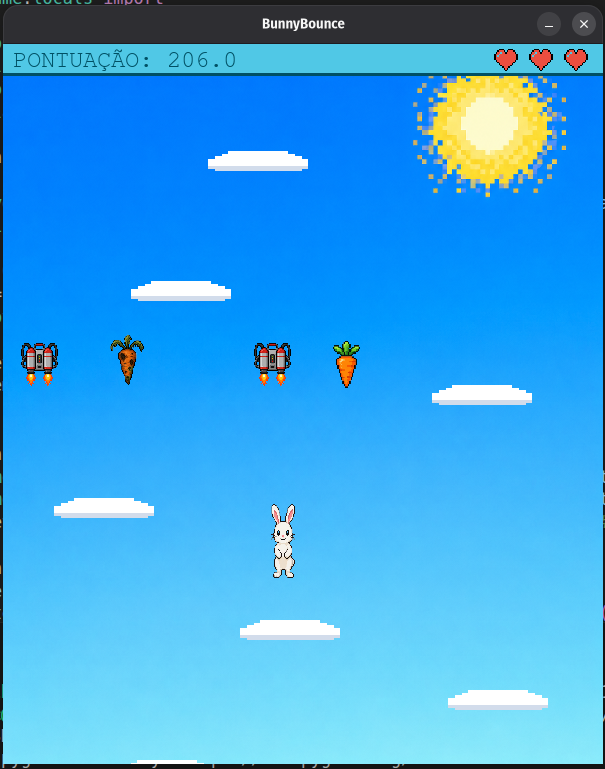
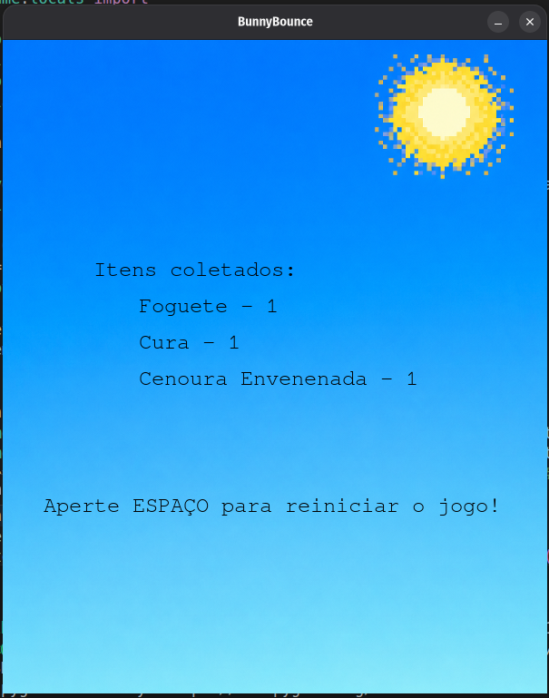

# Bunny Bounce - Projeto Final de IP
## Membros da Equipe:
- Daniel Bezerra de Morais (dbm5)
- André Lopes Aragão (ala8)
- Júlia Braz Costa Portela (jbcp)
- Vinicius Rodrigues Ferreira da Silva (vrfs2)

## Descrição do Jogo:
O jogo Bunny Bounce é um jogo de plataformas em que o personagem principal é um coelho branco cujo objetivo é pular nas plataformas e subir o mais alto que poder, podendo coletar cenouras que servem como cura, ou cenouras envenenadas que tiram parte de sua vida e fazem o coelho mudar de cor, ou foguetes que fazem o coelho subir ainda mais alto. 
### Como Jogar?
Basta importar o repositório do nosso projeto, instalar a biblioteca Pygame e rodar o arquivo jogo.py.
Durante o jogo, controle o coelho com as teclas A (move-o para a esquerda) e D (move-o para a direita).

## Organização do Código:
- *jogo.py:* Arquivo essencial do código. Onde se encontra o loop principal que roda o jogo, que analisa os diferentes objetos e suas colisões;
- *coelho.py:* Arquivo com a classe do personagem principal. Aqui que é definido os métodos dessa classe das principais ações do personagem;
- *coletaveis.py:* É o módulo com a classe geral de coletáveis e com as subclasses de cada coletável específico;
- *plataforma.py:* Arquivo com a classe das plataformas, onde é feita a definição das plataformas e suas funções dentro do jogo;
- *constantes.py:* É o módulo com valores pré-determinados e constantes durante o jogo;
- *sprites:* Pasta com as imagens utilizadas no jogo.

## Capturas de Tela:
### Jogabilidade:

### Tela Final:

## Ferramentas e Bibliotecas Utilizadas:
- **Python:** Linguagem de programação utilizada por todo o código, aprendida ao longo do período na disciplina;
- **Pygame:** Biblioteca da linguagem python que permitiu todo o desenvolvimento do jogo, visto a possibilidade de interface gráfica e análise das ações do jogador lendo seus inputs;
- **Random:** Biblioteca que permite sorteios. Muito utilizado para a definição aleatória das coordenadas dos coletáveis e das plataformas nas suas criações;
- **sys:** Biblioteca de onde importamos a função exit() que permite o encerramento do programa como reação a uma determinada ação;
- **VS Code:** Ambiente para o desenvolvimento do código utilizado pela equipe;
- **Git hub:** Plataforma onde foi criado o repositório do código e que permitia o compartilhamento do código feito por cada integrante para toda a equipe.

## Divisão do Trabalho:
- Daniel Bezerra: ficou responsável pelo desenvolvimento dos coletáveis;
- André Lopes: ficou responsável pela integração, testes e sincronização do sistema completo;
- Júlia Braz: ficou responsável pelo personagem principal e pelos sistemas de movimentação;
- Vinicius Rodrigues: ficou responsável pelas plataformas e suas funções no código;
- Todos: participaram da documentação, gestão e comunicaçṍes das tarefas.

## Conceitos Utilizados:
- **Programação Orientada a Objetos (POO):** Muito utilizado com a definição do personagem principal, dos coletáveis e das plataformas, e com seus métodos próprios que são chamados no arquivo principal; 
- **Condicionais:** Utilizado para determinar a imagem do coelho a ser mostrada, que depende da sua vida; para analisar as ações do jogador; para executar as funções da plataforma e dos coletáveis a depender das colisões; e para definir em qual estado do jogo está (menu, gameplay, tela final);
- **Laços de Repetição:** Utilizamos o comando *while* para manter o loop do jogo, e também utilizamos o comando *for* para iterar sobre listas e dicionários para que cada item passsasse pelas mesmas análises (como o desenho, a análise de colisão, a descida quando o coelho subia);
- **Funções:** Utilizado para organizar o programa em blocos e para evitar a repetição de linhas de código;
- **Listas:** Utilizadas para armazenar os objetos criados das classes plataforma e coletáveis, e também remover quando necessário para não utilizar muito da memória. Além disso, sua utilidade é marcada por poder ser iterável;
- **Dicionários:** Utilizado para contar quantos coletáveis de cada tipo o jogador coletou, sendo a chave o tipo de coletável e o valor a quantidade. Também tem sua utilidade marcada por poder ser iterável.

## Desafios e Erros:
Tivemos bastante dificuldade com o uso do git hub e com a ideia de modularização do código, visto que cada integrante fez sua parte separadamente e deveria ser juntado no final no arquivo principal. Além disso, também houve o cuidado necessário com a remoção dos objetos durante o jogo, já que poderiam exigir muito da memória a medida que o jogo continuava rodando. Tais desafios e erros foram superados com pesquisas e buscando ajuda aos monitores.

## Lições Aprendidas:
- *Organização Modular:* Aprendemos que dividir o código em módulos facilita a divisão de tarefas e a organização final do codigo para eventuais mudanças;
- *Planejamento e divisões de tarefas:* Percebemos que dividir as tarefas entre os membros facilita a organização e permite um melhor resultado no final do projeto;
- *POO:* Aprendemos que o uso de POO no código ajuda na organização do código e na definição de cada parte do código com sua determinada função.